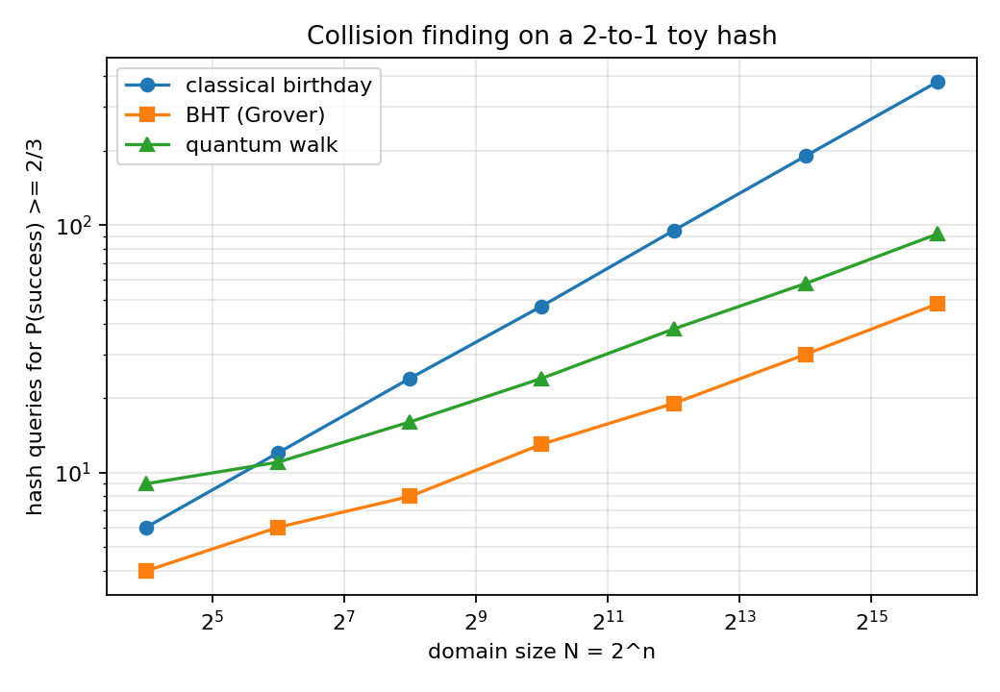

# Twin Finder: what would a quantum hash-collision attack really cost?

**Track 3: Quantum Software** (with touches of Track 1, interactive explainer, and Track 2, a real-hardware run with noise studies)

> Most quantum-search demos stop at "fewer queries". Twin Finder goes one level down: it **builds the hash function as a real quantum circuit**, **counts the actual gates**, runs the search methods as **real Qiskit circuits**, and shows an honest table of **when quantum really wins, and by how much**.

---

## 1. The problem in one minute

A **hash function** (we call it the *scrambler*) turns a number into a shorter number, its *fingerprint*. A **collision** (we call it a *twin*) is two different numbers with the same fingerprint. Finding collisions is the classic attack on hashes.

Our toy scrambler maps an n-bit number to an (n-1)-bit fingerprint and is **exactly 2-to-1**: every number has exactly one twin. That makes the maths exact and lets us check everything.

Three ways to find a twin, all implemented here:

| Method | Idea | Query cost for N = 2ⁿ numbers |
|---|---|---|
| **Normal guessing** (birthday) | hash random numbers until two fingerprints match | about 1.25·N^(1/2) |
| **Quantum search** (BHT, built on Grover) | keep a short list, let Grover search for any number whose twin is on the list | about N^(1/3) |
| **Quantum wander** (Ambainis quantum walk) | a quantum walk over possible lists, pushed toward lists that contain a twin | about N^(1/3) |

There is also a second goal, **Crack mode**: find another number with the same fingerprint as *your* password's number (pure Grover, about N^(1/2) vs N/2).

---

## 2. What is in the box

| Piece | What it does |
|---|---|
| **Live web app** (`app.py` + `index.html`) | Type a password. Step by step (each step waits for your click): password becomes a number, the number goes through the scrambler bit by bit, three methods race live, then **Step 4 re-scrambles every answer to prove the twins really match**. |
| **Real Qiskit everywhere** | Grover, BHT and the quantum walk all run as `QuantumCircuit`s on Aer. Default engine is Qiskit at every size, up to 16 bits. |
| **Scrambler as a quantum circuit** (`hash_circuit.py`) | The hash built from reversible quantum adders. **Verified against the Python scrambler on every possible input at 3, 4 and 5 bits: 0 mistakes in 8, 16 and 32 inputs.** |
| **Real-cost estimator** (`cost_report.py`) | Counts Toffoli ("hard step") gates for each method including the scrambler, charges all methods in one unit, and finds break-even sizes. |
| **Quantum walk in Qiskit** (`qwalk_qiskit.py`) | Walk on the Johnson graph as a circuit; checked against NumPy and against a full un-reduced 8-qubit Qiskit circuit. |
| **Noise lab** | Click a lane to see success rate versus search steps when every gate has a chance of error (Aer depolarizing noise for Grover/BHT, density-matrix model for the walk). |
| **Real IBM chip run** (`ibm_run.py`) | Runs the search on IBM hardware via `qiskit-ibm-runtime` (`SamplerV2`, dynamical decoupling, gate twirling) and compares to the perfect curve. `--fake` runs a noisy model of an IBM chip with no account. Results show in the app. |
| **Saved runs + tables** | Every race is stored in the browser. End-of-run menu: table of all runs (averages, CSV export), real-cost tables, real-chip result. |
| **Scaling study** (`scaling.py`) | 4 to 16 bits, log-log slope fit, Aer validation of the Grover theory. |

---

## 3. Headline results (all reproducible, see section 8)

### 3.1 Query counts (success probability ≥ 2/3, exact simulations, `scaling.py`)

| n (bits) | N | Normal | BHT | Quantum walk |
|---|---|---|---|---|
| 4 | 16 | 6 | 4 | 9 |
| 8 | 256 | 24 | 8 | 16 |
| 12 | 4,096 | 95 | 19 | 38 |
| 16 | 65,536 | 379 | 48 | 92 |



Fitted growth, queries ∝ N^s over n = 8..16: **normal s = 0.499, BHT s = 0.319, walk s = 0.316**, matching theory (1/2, 1/3, 1/3).

### 3.2 The scrambler as a circuit (`hash_circuit.py`)

Registers: input x (n qubits, kept), v (n), o (n), plus 1 shared helper qubit, so **3n+1 qubits**. Steps: `v = x·A + C` (one ripple-carry adder per 1-bit of A), `v ^= v >> s` (CNOTs), `o = v·B` (adders). Fingerprint = o without its lowest bit.

| bits n | 4 | 8 | 12 | 16 | 24 | 32 | 48 | 64 |
|---|---|---|---|---|---|---|---|---|
| Toffoli gates for one scrambler run (H) | 28 | 96 | 216 | 282 | 690 | 1,132 | 2,856 | 4,290 |

The adder-by-adder count used for large n equals the count from the fully transpiled circuit at n = 3, 4, 5 (asserted in code).

### 3.3 The honest cost table (`cost_report.py`, also in the app)

Unit: Toffoli gates. A normal try is charged H (one scrambler run). A quantum oracle call costs 2H (run, then un-run) + compare + flip. The list size r is chosen to **minimise real gate cost**, not queries.

| Goal | Size | Normal | Quantum | Quantum ÷ Normal |
|---|---|---|---|---|
| Twin of **my** number (Grover) | 16 bits | 9.2e6 | 1.25e5 | 0.0135 |
| Twin of **my** number (Grover) | 64 bits | 4.0e22 | 3.0e13 | 7.5e-10 |
| **Any** twin (BHT) | 16 bits | 9.1e4 | 3.0e4 (r = 23) | 0.34 |
| **Any** twin (BHT) | 64 bits | 2.3e13 | 4.3e12 (r = 70) | 0.18 |

Findings:

1. **Grover (twin of my number):** the square-root speed-up survives full gate counting and grows with size.
2. **BHT (any twin):** the textbook N^(1/3) advantage **mostly disappears once the list is paid for.** Checking a list of r entries costs about r comparisons per Grover step, so the cheapest list is tiny (about 70 entries at 64 bits) and the gain shrinks to a constant of about 3 to 5×. Using the textbook list size N^(1/3) is far more expensive (red column in the app).
3. **Reality check column:** "Max slowdown it can afford" = 1 ÷ ratio. For "any twin" it is only about 3 to 5×, so a quantum computer whose hard step is thousands of times slower than a classical one loses.
4. In raw gate counts the quantum side is ahead at every size we tested (from 4 bits up), but this ignores speed and error correction (see limitations).

### 3.4 Real-hardware style run (`ibm_run.py --fake`, noisy model of IBM Sherbrooke; this is **not** a real chip)

hunter2 at 3 bits, one twin among 8 numbers, 4000 shots (guessing = 12.5%):

| Grover steps | 0 | 1 | 2 | 3 | 4 |
|---|---|---|---|---|---|
| Perfect machine | 12.5% | 78.1% | **94.5%** | 33.0% | 1.2% |
| Noisy model | 12.2% | 69.2% | **74.2%** | 27.8% | 7.0% |
| Two-qubit gates | 0 | 19 | 37 | 59 | 77 |

More steps cost more gates, each gate adds errors, so the curve flattens and then collapses. `--real` produces the same table from an actual IBM backend (not run by the authors of this README unless stated in `ibm_results.json`, whose `real` field says so).

---

## 4. Quantum techniques used

| Technique | Where | How it is checked |
|---|---|---|
| **Grover search**: phase oracle (one multi-controlled-Z per marked state), diffusion (H, X, MCZ, X, H) | `bht_collision.py`, `app.py` | 4000-shot Aer circuit vs sin²((2j+1)θ): j=1 0.187/0.198, j=2 0.477/0.483, j=3 0.775/0.774, j=4 0.965/0.965 |
| **BHT collision finding** with unknown-solution-count Grover (BBHT) | `bht_collision.py` | all returned pairs verified to collide |
| **Optimal list size by real gate cost** | `cost_report.py` | grid search over r |
| **Ambainis quantum walk on the Johnson graph** (two reflections D1, D2 per step; oracle flips lists with a twin) | `qwalk.py`, `qwalk_qiskit.py` | see next row |
| **Exact symmetry reduction of the walk**: the hash is a perfect matching, so lists with equal numbers of complete pairs behave identically. State space drops from C(N,r)·(N−r) to about 2r (39 dimensions at 16 bits). | `qwalk.build_lumped` | vs full Hilbert space: max error 1e-15 (N = 16, 8). |
| **Walk as a real circuit**: `StatePreparation`, oracle as `DiagonalGate`, reflections as `UnitaryGate`, one circuit with `save_statevector` after every step, final measurement on Aer | `qwalk_qiskit.py` | vs NumPy: ≤ 6e-14 (N = 16, 64, 256); vs a full un-reduced 8-qubit Qiskit circuit (N = 8, r = 2): 1.4e-15 |
| **Reversible arithmetic**: constant multiplication by shift-and-add using Qiskit's `CDKMRippleCarryAdder`, XOR-shift by CNOT ladder | `hash_circuit.py` | exhaustive truth-table check, n = 3..5 |
| **Resource estimation by transpilation** into `{ccx, cx, x}`; separate basis `{cx, rz, sx, x}` for per-step gate/depth stats | `hash_circuit.py`, `app.py` | adder-sum equals full-circuit count |
| **Noise modelling**: depolarizing error on cx (rate) and single-qubit gates (rate/10), sweeps 0 to 0.5% | `app.py` (`_noisy_grover`) | curves vs ideal in the app |
| **Hardware workflow**: `QiskitRuntimeService`, `SamplerV2`, dynamical decoupling, gate twirling, ISA transpilation at optimization level 3 | `ibm_run.py` | `--fake` path tested end-to-end |

Per-step gate cost of a single-target Grover iteration at 16 bits (transpiled to `cx, rz, sx, x`): oracle 3,899 gates + diffusion 4,011 gates, **2,400 of them two-qubit**; the app's detail panel multiplies this by the number of steps to give whole-program totals.

---

## 5. Quick start

```bash
git clone <this repo> && cd <this repo>
python -m venv .venv && source .venv/bin/activate      # Windows: .venv\Scripts\activate
pip install -r requirements.txt
python app.py
# open http://127.0.0.1:5000
```

Keep these files in one folder: `app.py`, `index.html`, `qwalk.py`, `qwalk_qiskit.py`, `scaling.py`, `bht_collision.py`, `hash_circuit.py`, `cost_report.py`, `cost_table.json`, `ibm_results.json` (`index.html` may also live in `static/`).

### Using the app

1. Type a password (or choose **Number (PIN)** mode), pick the size in bits and the goal (*any twin* with 3 methods, or *Crack* with 2).
2. Press **Scramble & race**. Press the black **Step N** button at the bottom of the screen at each pause. Click any step heading to collapse it.
3. **Step 1** shows each character's code and how they combine into one number. **Step 2** shows the number going through the four scrambler stages bit by bit. **Step 3** is the live race. **Step 4** re-scrambles the answers and prints a table that proves the twins share a fingerprint.
4. After the race, click a lane for its detail panel: tries per attempt, success chance, qubits, gate counts, and the **noise slider**.
5. The end-of-run menu offers: **Table of all my runs**, **What it would really cost**, **Real chip result**. The **Saved runs** button at the top opens the history any time.

Slow-motion and "fast NumPy shortcut" chips are available. The default is **real Qiskit circuits**; at 16 bits a BHT race takes about 4 s and the walk about 2 s on a laptop-class CPU (timed in our test).

### API (for scripting)

| Route | Returns |
|---|---|
| `GET /api/prepare?pw=&n=&kind=&mode=` | password number, scrambler constants and stage values |
| `GET /api/stream?...&engine=qiskit` | live race as server-sent events |
| `GET /api/trace?pw=&n=&xs=1,2,3` | scrambler stage values for any numbers (used by Step 4) |
| `GET /api/details?method=&n=` | method facts, qubits, gate counts |
| `GET /api/noise?method=&n=&pw=` | success-versus-steps under noise |
| `GET /api/cost` | the real-cost table |
| `GET /api/ibm` | the latest hardware (or model) result |

---

## 6. Running the real IBM chip

```bash
# .env  (next to ibm_run.py; never commit this file)
QISKIT_IBM_TOKEN=your_key_here
# QISKIT_IBM_INSTANCE=your_instance_crn      # only if your plan requires it

python ibm_run.py --fake                      # no account: noisy model of IBM Sherbrooke
python ibm_run.py --real                      # least-busy real backend
python ibm_run.py --real --backend ibm_xxx --pw hunter2 --n 3 --shots 4000
```

It writes `ibm_results.json` and `ibm_results.png`. Reload the app and click **Real chip result**; the page states plainly whether the data is a real chip or a model. Default size is 3 bits (8 numbers) so the circuit is short enough for today's hardware; more steps are run on purpose to show noise winning past the peak.

---

## 7. Project layout

```
app.py              Flask server, scrambler class, live race threads, noise, APIs
index.html          single-page UI: step gating, animation, tables, saved runs
bht_collision.py    toy hash, classical birthday, Grover circuit, BHT (BBHT) on Aer
qwalk.py            Johnson-graph walk, symmetry-reduced simulation, full-space cross-check
qwalk_qiskit.py     the walk as a Qiskit circuit + full-space Qiskit check
hash_circuit.py     scrambler as reversible circuit + exhaustive verification
cost_report.py      Toffoli accounting, break-even finder -> cost_table.json
scaling.py          scaling study, slope fit, Aer validation, scaling.png
ibm_run.py          IBM hardware / fake-backend run -> ibm_results.json/png
cost_table.json     precomputed cost table served by /api/cost
```

---

## 8. Reproduce every claim

| Claim | Command | Expected |
|---|---|---|
| Walk reduction is exact | `python qwalk.py` | differences ≈ 1e-15 |
| Qiskit walk = NumPy walk = full space | `python qwalk_qiskit.py` | ≤ 1e-13, 1.4e-15, shot success ≈ 0.7 |
| Grover circuit matches theory | `python scaling.py` | table in section 4, slopes 0.499 / 0.319 / 0.316 |
| Scrambler circuit = Python scrambler | `python hash_circuit.py` | `wrong: 0` for n = 3, 4, 5 (about 10 s) |
| Real-cost table | `python cost_report.py` | table in section 3.3; quantum already ahead in raw gate count at 4 bits for both goals |
| BHT works on Aer | `python bht_collision.py` | `ok = True` at 4, 6, 8 bits (we saw mean queries 5.8 / 10.5 / 17.5 for BHT vs 5.1 / 10.3 / 20.3 for guessing: at these tiny sizes the quantum method only starts to pull ahead around 8 bits) |
| Hardware workflow | `python ibm_run.py --fake` | section 3.4 table (noise draws are seeded) |

---

## 9. Honest limitations (please read)

- **The hash is a toy.** It is not cryptographic. It was chosen to be exactly 2-to-1 so that every result can be checked exhaustively.
- **Walk answer pair.** The walk runs on the symmetry-reduced basis. The circuit is measured for real, which decides success or failure, but that basis does not record *which* pair is in the list. When the walk succeeds, the pair shown is drawn uniformly, which has the same distribution a real measurement would give by symmetry. It is not read bit by bit from the circuit.
- **Walk cost is a lower bound.** The walk's reflections are dense `UnitaryGate`s, not compiled into a structured circuit with table registers and insert/delete operations. The cost table counts only its hash evaluations and says so.
- **Race oracle truth tables** in the live Grover/BHT circuits are built classically for simulation (BHT's "marked" set is computed from the table). The hash-circuit and cost-table modules account for the real oracle cost; the live circuits do not embed the hash.
- **Walk noise chart** is a NumPy density-matrix model, not an Aer noise simulation. Grover/BHT noise charts use Aer.
- **The cost table counts gates, not time.** No error correction, no magic-state factories, no connectivity or routing cost. A cleverer adder or multiplier design may shrink every number; we did not try. A normal try is charged the same Toffoli-count unit, which flatters the quantum side because quantum hard steps are far slower in practice.
- **Hardware.** `ibm_results.json` ships with a noisy-model result. A real-chip result exists only after you run `--real`.

---

## 10. Roadmap

1. Error-correction estimate (surface-code memory with `stim` and `pymatching`): physical qubits and wall-clock time for the 64-bit search.
2. A structured walk circuit with real table registers, so the walk gets an exact gate count and a true pair read-out.
3. A custom transpiler pass for the Grover oracle (Gray-code ordering of marked states to cancel X layers), benchmarked against Qiskit's routing on line and heavy-hex layouts.
4. Scrambler design study: which recipes are cheap to run classically but costly to build as a quantum circuit.
5. Package the symmetry-reduced walk as a Qiskit `BackendV2` and benchmark memory and time against Aer.

---

## 11. Tech stack

Python 3.12, Qiskit 2.5, Qiskit Aer 0.17, qiskit-ibm-runtime 0.50, NumPy, Flask (server-sent events for the live race), Matplotlib, plain HTML/CSS/JavaScript (no build step).

## 12. Credits and references

- Grover, *A fast quantum mechanical algorithm for database search* (1996)
- Brassard, Høyer, Tapp, *Quantum cryptanalysis of hash and claw-free functions* (1997)
- Ambainis, *Quantum walk algorithm for element distinctness* (2004)
- Szegedy, *Quantum speed-up of Markov chain based algorithms* (2004)
- Boyer, Brassard, Høyer, Tapp, *Tight bounds on quantum searching* (1996)
- Cuccaro, Draper, Kutin, Moulton, *A new quantum ripple-carry addition circuit* (2004)
- Bernstein, *Cost analysis of hash collisions: will quantum computers make SHARCS obsolete?* (2009), the classic argument that hardware cost can erase collision-search speed-ups, which our cost table reproduces in miniature
